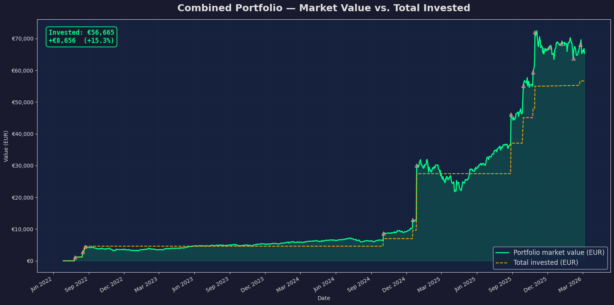

# Portefee

[](https://colab.research.google.com/github/barrynauta/portefee/blob/main/portefee.ipynb)

A small pet project that I use to learn coding using dataframes, data visualisation

Todo:
* Load data from an external file instead of inline data
* Include SELL posibilitie

  
Using the following dummy data:

```
# ─── Yahoo Finance ticker mapping ───────────────────────────
TICKER_MAP = {
    "MSFT":   "MSFT",
    "GOOGL":  "GOOGL",
    "NVDA":   "NVDA",
    "AMZN":   "AMZN",
    "BEL20":  "BEL.BR",
}

# ─── Currency per position ──────────────────────────────────
TICKER_CURRENCY = {
    "MSFT": "USD", "GOOGL": "USD", "NVDA": "USD", "AMZN": "USD",
    "BEL20": "EUR",
}
```
And the following 
```
# ─── Buy history ───────────────────────────────────────────
# Format: (date, num_shares, price_per_share, total_costs)
# Fictive list, provide your own
# Prices in native currency of the instrument

BUYS = {
    "MSFT": [
        ("2022-07-27", 5,  264.29, 22.04),
        ("2025-10-29", 15, 542.00, 0.00),
        ("2026-02-23", 4,  395.00, 5.55),
    ],
    "GOOGL": [
        ("2022-08-16", 15, 122.00, 25.95),
        ("2024-10-02", 16, 167.78, 16.55),
        ("2025-10-24", 12, 260.79, 18.33),
    ],
    "NVDA": [
        ("2024-12-27", 145, 138.51, 131.11),
        ("2025-08-28", 60,  180.93, 63.38),
        ("2025-09-29", 50,  181.62, 52.72),
    ],
    "AMZN": [
        ("2022-08-22", 15, 135.00, 28.02),
        ("2024-12-17", 13, 232.40, 19.59),
    ],
    "BEL20": [
        ("2025-12-05", 1, 76.16, 0.09),
        ("2026-01-05", 1, 75.95, 0.09),
        ("2026-02-05", 1, 81.87, 0.10),
    ],
}
```

We get information like:


Or



and overview information like:

|    | Ticker   | Currency   |   Shares |   Avg Buy Price |   Total Cost |   Cost (EUR) |   Current Price |   Market Value |   Value (EUR) |      P/L |   P/L (EUR) |   P/L % |
|---:|:---------|:-----------|---------:|----------------:|-------------:|-------------:|----------------:|---------------:|--------------:|---------:|------------:|--------:|
|  0 | MSFT     | USD        |       24 |          459.64 |     11059    |      9731.96 |          408.96 |        9815.04 |       8637.24 | -1244    |    -1094.72 |   -11.2 |
|  1 | GOOGL    | USD        |       43 |          177.77 |      7704.79 |      6780.22 |          298.52 |       12836.4  |      11296    |  5131.57 |     4515.78 |    66.6 |
|  2 | NVDA     | USD        |      255 |          156.94 |     40268    |     35435.8  |          177.82 |       45344.1  |      39902.8  |  5076.14 |     4467    |    12.6 |
|  3 | AMZN     | USD        |       28 |          180.22 |      5093.81 |      4482.55 |          213.21 |        5969.88 |       5253.49 |   876.07 |      770.94 |    17.2 |
|  4 | BEL20    | EUR        |        3 |           77.99 |       234.26 |       234.26 |           76.98 |         230.94 |        230.94 |    -3.32 |       -3.32 |    -1.4 |


```
════════════════════════════════════════════════════════════
🧚 PORTEFEE — PORTFOLIO AGGREGATE
════════════════════════════════════════════════════════════
  Positions tracked:      5 / 5
  Total invested (EUR):   €   56,664.79
  Current value (EUR):    €   65,320.48
  ──────────────────────────────────────
  📈 Total P/L (EUR):      +€   8,655.68  (+15.3%)
  ──────────────────────────────────────
  Holding period:         1320 days (3.6 years)
  Simple annualized:      +4.0%  (assumes lump sum)
  XIRR annualized:        +14.5%  (accounts for timing of buys)
  ──────────────────────────────────────
  Compare to benchmarks:
    S&P 500 avg:          ~10-11% / year
    MSCI World avg:       ~8-9% / year
    Euro savings rate:    ~2-3% / year
  ──────────────────────────────────────
  💡 XIRR is the most accurate measure
     for your portfolio since it accounts
     for the actual timing and size of
     each individual purchase.
```
